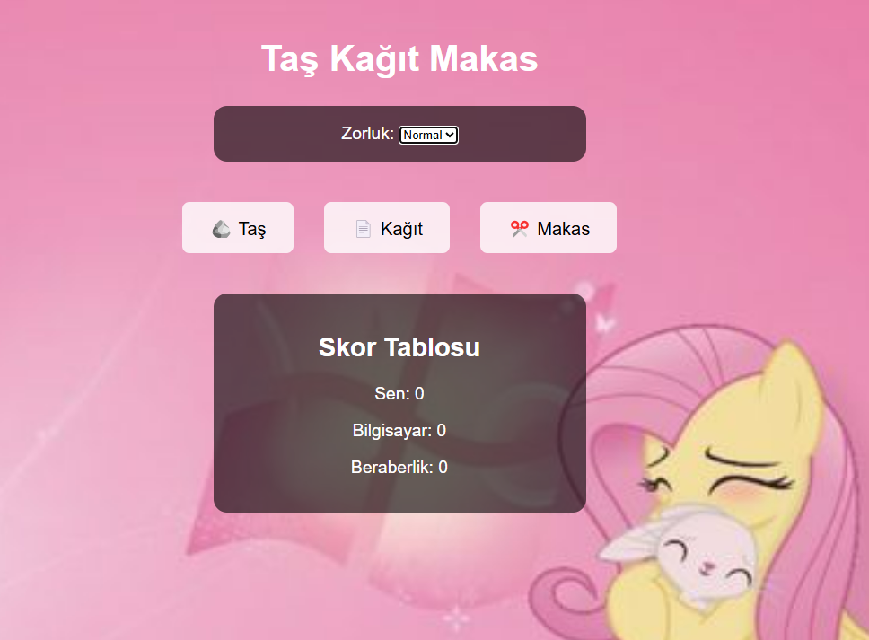

# MiniGameRockPaperScissors
# 🎮 Mini Oyun: Taş-Kağıt-Makas

Bu web tabanlı mini oyunda klasik **Taş-Kağıt-Makas** oyununu oynayabilir, skorunu takip edebilir, zorluk seviyesi belirleyebilir ve ses efektleriyle eğlenceli bir deneyim yaşayabilirsin!

---

## 🚀 Özellikler

- 🧠 **Zorluk Seviyesi**: Kolay / Normal / Zor seçenekleri
- 🔉 **Ses Efektleri**: Kazanma, kaybetme ve beraberlik için özel sesler
- 📈 **Skor Takibi**: Oyuncu, bilgisayar ve beraberlik skorları
- 🌄 **Arka Plan Görseli**: `asd.png` arka plan ile şık bir görünüm
- 💻 **Tamamen Tarayıcı Üzerinden Çalışır**

---

## 🖼️ Ekran Görüntüsü

  
---

## 📂 Dosya Yapısı

rps-game/ 
├── index.html # Ana HTML dosyası
 ├── style.css # Stil dosyası 
 ├── script.js # Oyun mantığı ve sesler 
 ├── ss.png # Arka plan resmi 
 ├── asd.png # Arka plan resmi 
 ├── win.mp3 # Kazanma sesi 
 ├── lose.mp3 # Kaybetme sesi 
 └── tie.mp3 # Beraberlik sesi